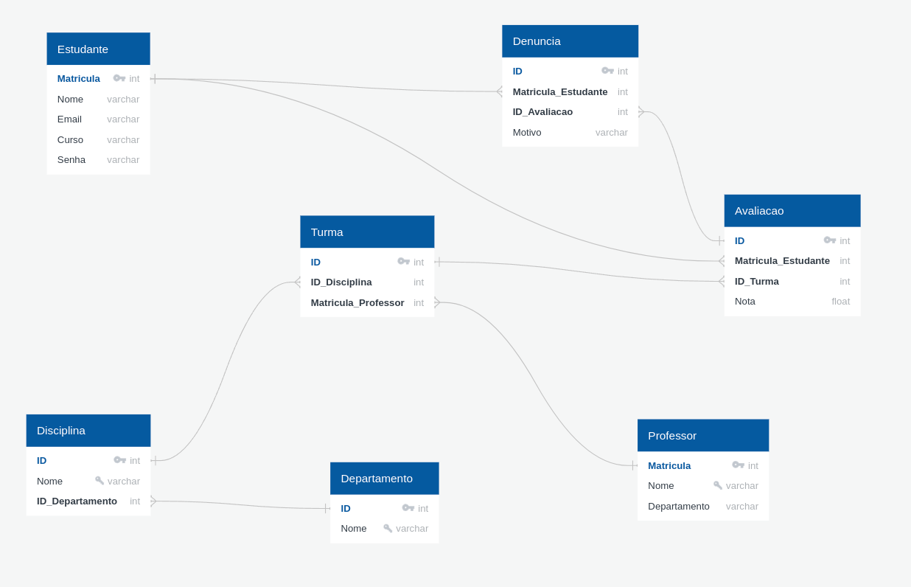

# BD-2023.1

## **Descrição**
- Para auxiliar os estudantes na escolha de disciplinas, você ficou encarregado de elaborar um sistema onde estudantes podem avaliar professores de disciplinas.

- O programa vai permitir que estudantes se cadastrem e postem avaliações de professores e turmas de diferentes semestres.

-  Comentários ofesivos podem ser denunciados por usuários, que estão são avaliados por administradores. 

- Os administradores podem ignorar a denúncia, aceitá-la e remover o comentário ofensivo até mesmo excluir uma conta de algum estudante. 

- Os estudantes também podem editar e excluir seus próprios comentários.

## Modelo Conceitual

### Entidades

- **estudante**
    - matricula
    - nome
    - email
    - curso
    - senha
    - admin
    - foto

- **Professor**
    - matricula
    - nome
    - departamento

- **Disciplina**
    - id
    - nome
    - id_departamento

- **Turma**
    - id
    - id_disciplina
    - id_professor

- **Departamento**
    - id
    - nome

- **Avaliação**
    - id
    - id_estudante
    - id_turma
    - comentario
    - nota

- **Denúncia**
    - id
    - id_estudante
    - id_avaliacao
    - motivo

### Regras de Negócio

- Os usuários e administradores do sistema são estudantes da UnB (com e-mail, matrícula, curso, senha, etc.).
- Professores e disciplinas estão relacionados com departamentos.
- Disciplinas estão relacionadas a departamentos.
- Turmas estão relacionadas com professores e disciplinas.
- Avaliações só podem ser feitas por estudantes.
- Denúncias de avaliações são feitas por estudantes e são avaliadas por administradores.

## Modelo Lógico (Relacional)

Veja também [Diagrama pdf](~/../assets/DocsDB.pdf)
### Chaves Primárias e Chaves Estrangeiras

- Chaves Primárias:
    - Estudante: Matricula
    - Professor: Matricula
    - Disciplina: ID
    - Turma: ID
    - Departamento: ID
    - Avaliação: ID
    - Denúncia: ID

- Chaves Estrangeiras:
    - Disciplina: ID_Departamento references Departamento.ID
    - Turma: ID_Disciplina references Disciplina.ID
    - Turma: Matricula_Professor references Professor.Matricula
    - Avaliação: Matricula references Estudante.Matricula
    - Avaliação: ID_Turma references Turma.ID
    - Denúncia: Matricula_Estudante references Estudante.Matricula
    - Denúncia: ID_Avaliação references Avaliação.ID
